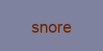

# CNN-Image
Image text recognition with Convolutional Neural Networks using TensorFlow

## Requirements    
- Python 3.5  
- TensorFlow  
- OpenCV  

## Problem
Create an English word image generator and implement a Convolutional Neural Network model using Python and TensorFlow to recognize the text from the generated images.

## Images
You may use you own images or use the generate_image.py to generate the images. However, at this moment, only images of size (128x64) with words between length of four to ten are supported. This is also the specification of the images generated from generate_image.py. Enhancement will be made in the future. 

A typical training image looks like:




## Usage
1. Generate the images with English words. You can do this repeatedly for generating your training and validation/test set. However, be aware that the number of English words available is just around 22000 at this stage. It may take a while to load the English words into the list. Also, the arguments ```images_labels_save.csv``` should be a csv file to save the actual words as labels to be used by training and validation.

    ```
    $ python generate_image.py no_of_images images_save_path images_labels_save.csv 
    ```  
    
    
2. Train the CNN model. You can change the network architecture and model parameters in this file. Notice that the training time might be long for large data set. The trained model will be saved to the model file in the current working directory.

    ```
    $ python cnn_train.py train_images_path train_images_labels.csv
    ```  
    
     
3. (Optional) View Tensorboard visualizations via ```$ tensorboard --logdir=model_path``` 

     
4. Validate you model with a new set of data. A csv file contains the metrics will be created in the current working directory.

    ```
    $ python cnn_val.py validation_images_path validation_images_labels.csv
    ```  
    
    
5. Use the model to predict the English words from the images. A csv file contains the predicted text will be created in the current working directory.

    ```
    $ python cnn_classify_image.py test_images_path
    ```
 
